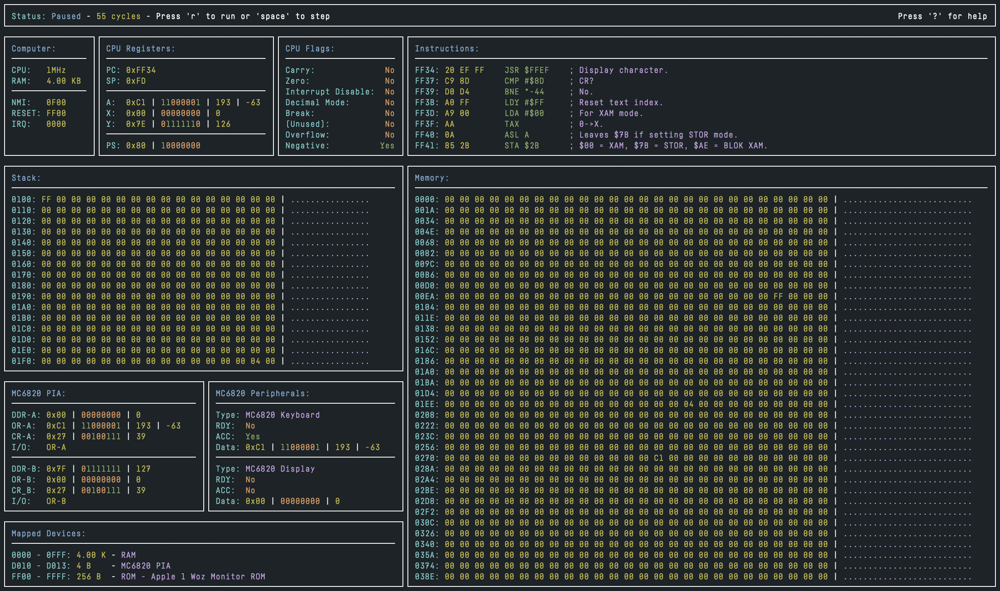

MOS-6502-Emulator
=================

  

### About

A MOS 6502 emulator written in Swift.

**Debugger Shortcuts**

    [space]    Pause/Step
    r          Run
    z          Reset CPU
    h          Set CPU frequency
    +/-        Scroll memory up or down
    m          Edit memory
    p          Set the PC register
    s          Set the SP register
    a          Set the A register
    x          Set the X register
    y          Set the Y register
    f          Set the PS register
    k          Enter keyboard input
    $          Show instructions history

**Cloning:**  
This repository uses submodules. Please clone with:

    git clone --recursive https://github.com/macmade/MOS-6502-Emulator.git

### MOS 6502 Reference

  1. [Introduction](https://github.com/macmade/MOS-6502-Emulator/blob/main/Reference/1-Introduction.md)
  2. [Architecture](https://github.com/macmade/MOS-6502-Emulator/blob/main/Reference/2-Architecture.md)
  3. [Registers](https://github.com/macmade/MOS-6502-Emulator/blob/main/Reference/3-Registers.md)
  4. [Instructions](https://github.com/macmade/MOS-6502-Emulator/blob/main/Reference/4-Instructions.md)
  5. [Addressing](https://github.com/macmade/MOS-6502-Emulator/blob/main/Reference/5-Addressing.md)
  6. [Algorithms](https://github.com/macmade/MOS-6502-Emulator/blob/main/Reference/6-Algorithms.md)
  7. [Reference](https://github.com/macmade/MOS-6502-Emulator/blob/main/Reference/7-Reference.md)
  8. [Downloads](https://github.com/macmade/MOS-6502-Emulator/blob/main/Reference/8-Downloads.md)
  9. [Links](https://github.com/macmade/MOS-6502-Emulator/blob/main/Reference/9-Links.md)

### Datasheets

  1. [MOS Microcomputers Hardware Manual](https://github.com/macmade/MOS-6502-Emulator/blob/main/Datasheets/MOS-Microcomputers-Hardware-Manual.pdf)
  2. [MOS Microcomputers Programming Manual](https://github.com/macmade/MOS-6502-Emulator/blob/main/Datasheets/MOS-Microcomputers-Programming-Manual.pdf)
  3. [Rockwell R650X / R651X](https://github.com/macmade/MOS-6502-Emulator/blob/main/Datasheets/Rockwell-R650X-R651X.pdf)
  4. [Synertek SY6500](https://github.com/macmade/MOS-6502-Emulator/blob/main/Datasheets/Synertek-SY6500.pdf)
  5. [Motorola MC6820](https://github.com/macmade/MOS-6502-Emulator/blob/main/Datasheets/Motorola-MC6820.pdf)
  5. [Apple-1 Operation Manual](https://github.com/macmade/MOS-6502-Emulator/blob/main/Datasheets/Apple-1-Operation-Manual.pdf)
  
### Useful Links

  - http://www.6502.org/
  - https://www.c64-wiki.com/
  - https://www.nesdev.org/
  - https://www.nesdev.org/obelisk-6502-guide/
  - https://en.wikibooks.org/wiki/6502_Assembly
  - http://skilldrick.github.io/easy6502/
  - https://k7mem.com/VC_MEK6800_D1_MC6820_PIA.html
  
### ROMS

  - http://www.zimmers.net/anonftp/pub/cbm/firmware/computers/c64/
  - https://mirrors.apple2.org.za/Apple%20II%20Documentation%20Project/Computers/
  - https://www.nesdev.org/wiki/Emulator_tests

License
-------

Project is released under the terms of the MIT License.

Repository Infos
----------------

    Owner:          Jean-David Gadina - XS-Labs
    Web:            www.xs-labs.com
    Blog:           www.noxeos.com
    Twitter:        @macmade
    GitHub:         github.com/macmade
    LinkedIn:       ch.linkedin.com/in/macmade/
    StackOverflow:  stackoverflow.com/users/182676/macmade
